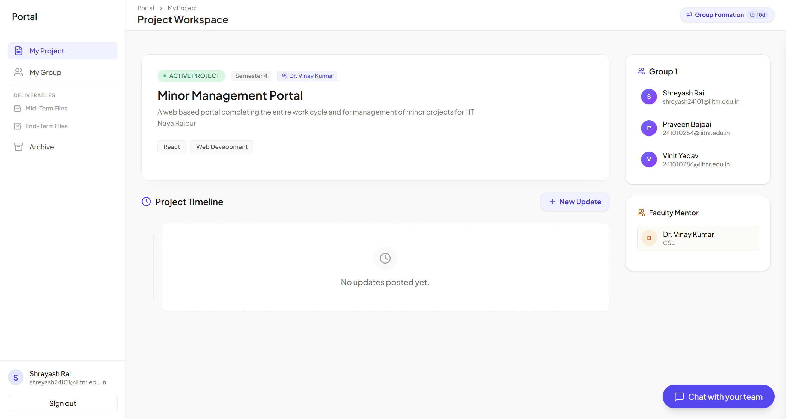
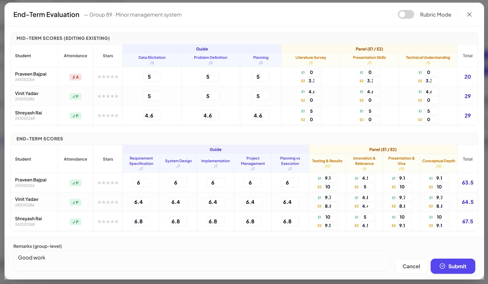
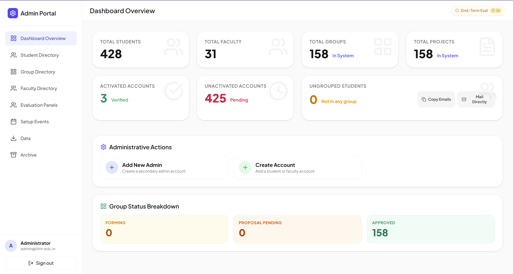
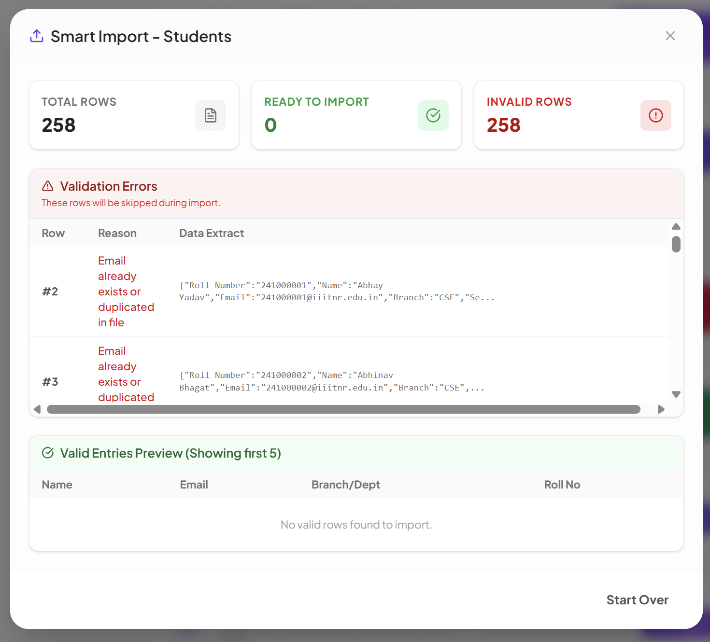

<div align="center">

<h1>&nbsp; Minor Project Management Portal</h1>

### The production platform that runs every B.Tech. minor project at IIIT Naya Raipur, end to end.

<a href="https://minor-project.iiitnr.ac.in"></a>

<br>


</div>

I built and shipped this to replace the spreadsheets and email threads our department used to run minor projects on. It owns the full cycle for students, faculty, and the office: group formation, project proposals, guide selection, mid and end term evaluations, and automatic archival when the semester rolls over. It runs in production at the institute behind Nginx and SSL, live at **[minor-project.iiitnr.ac.in](https://minor-project.iiitnr.ac.in)**.

<p align="center"></p>

## What it does

Three roles, one app. Each dashboard reshapes itself around the current phase of the semester.

| Students | Faculty | Admin (office) |
|---|---|---|
| Form groups, invite teammates | Approve or reject proposals with feedback | Control the active semester phase |
| Build proposals, pick a guide | Mentor groups, post updates | Bulk import students and faculty |
| Submit progress and eval files | Grade by rubric or direct marks | Auto split groups into eval panels |
| Real-time group chat | Per-student and group feedback | One-click exports (incl. official format) |
| View results and past projects | Panel evaluations across batches | Roll over the semester, archive the old one |

Some of the parts I'm happiest with:

- **Email-OTP onboarding** with a forced password change on first login.
- **Custom rubrics per event.** Faculty grade with auto-totals and capped fields, or just type a single final mark.
- **Auto-panel builder** that splits approved groups across faculty by remaining capacity.
- **Validation-first imports.** Every bulk upload is previewed row by row, with the exact reason each bad row is rejected, before anything touches the database.
- **Semester rollover** that snapshots and freezes the previous cycle into a read-only archive.
- **Real-time** notifications and group chat over Socket.IO.

### Faculty grade by rubric or direct entry
<p align="center"></p>

### Admin overview and controls
<p align="center"></p>

### Imports that never half-succeed
Bulk uploads run a dry run first. Bad rows get flagged with a reason and never touch the database.
<p align="center"></p>

## The parts that were actually hard

Most of this isn't CRUD. The real work was modelling a process that refuses to be tidy.

**Droppers.** A student repeating a semester works with a different batch than the one their roll number says. I added a `targetBatch` override and made the whole app resolve a student's cohort through that one rule, so the directory, faculty load, and panel assignment all agree. Keying off the roll-number year (the obvious shortcut) caused a string of bugs before I centralised it.

**Semester rollover.** Starting a new group-formation event archives every current group, project, and panel, resets faculty load counters, and emails the new batch. It can't be undone, so it sits behind the admin password. The catch is that archived projects keep their `Approved` status, so every "current semester" query has to deliberately skip archived data, or last semester leaks into this one.

**Faculty capacity.** Limits are global with per-batch overrides, counted only for the current semester and bucketed into the right cohort, droppers included. Get it wrong and a guide looks full when they aren't, and real approvals get rejected.

## Bugs I went looking for

I keep a running [`remaining_bugs.md`](remaining_bugs.md) where I audit the backend for logic and security holes and rank them by how much they'd actually hurt. A few I found and fixed:

| Bug | Cause | Why it mattered |
|---|---|---|
| Returning students couldn't form a new group | `getMyGroup` didn't filter out archived groups, so it returned last semester's | Broke every semester after the first |
| Anyone could read any group's private chat | The socket checked the token but never checked membership | Confidentiality hole |
| Faculty wrongly shown as full | Load count included archived approved projects from a past project | Blocked valid approvals |
| Account enumeration | Forgot-password and OTP replies differed for "no such user" vs "wrong code" | Leaked which emails exist |

The one I like best: the auth rate limiter was a flat 30 requests per minute per IP. On campus everyone shares one NAT'd IP, so during a submission rush the whole college would lock itself out. I switched it to a per-email brute-force guard that only counts failed attempts (so real users never get blocked), kept a generous per-IP backstop, and added a `TRUST_PROXY` setting so it sees real client IPs behind the proxy. The git history has 35 fix commits like this sitting next to the feature work.

## Tech stack

**Frontend:** React 19, TypeScript, Vite, TailwindCSS, Radix UI, Framer Motion, dnd-kit, Socket.IO client, Axios.

**Backend:** Node, Express 5, TypeScript, MongoDB with Mongoose, Socket.IO, JWT and bcrypt, Nodemailer (OTP), Multer (uploads), ExcelJS (exports), express-rate-limit.

**Testing:** Jest, Supertest and an in-memory MongoDB on the backend; Vitest and React Testing Library on the frontend.

**Infra:** Ansible, Nginx, Let's Encrypt, and a self-hosted GitHub Actions runner.

## Architecture

```
client/                 React + Vite SPA (axios with a 401 interceptor, socket client)
server/
  src/
    app.ts              Express app, split from index.ts so tests import the app, not the listener
    index.ts            Boot. Refuses to start without JWT_SECRET
    socket.ts           Socket.IO with JWT auth and per-group membership checks
    models/             User, Group, Project, Event, Panel, Message, Settings
    controllers/        auth, group, project, user, event, panel, import
    routes/             REST endpoints with per-route rate limiting
    utils/              shared group-numbering and archive filtering
    __tests__/          unit and integration against in-memory Mongo
ansible/                provisioning: server, Nginx, SSL, CI runner
```

Deployed at IIITNR behind Nginx and SSL, provisioned with Ansible plus a self-hosted Actions runner. Production runs the compiled `dist/`, so a deploy means build and restart, not just pull.

## Running it locally

You'll need Node.js and a running MongoDB.

```bash
# install (root, server, client)
npm install
cd server && npm install
cd ../client && npm install

# server/.env needs at least:
#   MONGO_URI=mongodb://localhost:27017/minor_management
#   JWT_SECRET=...        (required, server won't boot without it)
#   EMAIL_USER, EMAIL_PASS   (SMTP, for OTP emails)
#   CORS_ORIGINS=http://localhost:5173

# seed an admin, then run both backend (:5000) and frontend (:5173)
cd server && npm run seed:admin
cd .. && npm run dev
```

Tests: `cd server && npm test` and `cd client && npm test`.

---

<div align="center">

**[🌐 See it running at minor-project.iiitnr.ac.in](https://minor-project.iiitnr.ac.in)**

Designed, built, and deployed by [ItsMat78](https://github.com/ItsMat78).

</div>
