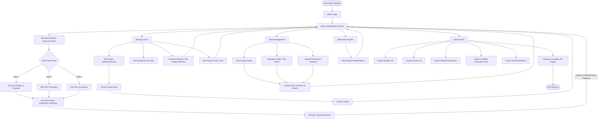

# Admin User Flow

```mermaid
graph TD
    %% Node Definitions
    Start([Start Admin Session])
    Login[Admin Login]
    Dashboard[Admin Dashboard Overview]
    
    %% Event Lifecycle Management
    EventMgmt[Manage Semester Lifecycle Events]
    SelectEvent{Select Event Type}
    EventGF[Group Formation & Proposal]
    EventMid[Mid-Term Evaluation]
    EventEnd[End-Term Evaluation]
    ConfigureEvent[Set Event Dates, Extensions & Batches]
    ToggleEvent[Activate / Deactivate Event]
    
    %% User Management
    UserMgmt[Manage Users]
    BulkImport[Bulk Import Students/Faculty]
    PreviewImport[Preview Import Data]
    CommitImport[Commit Import]
    EditUser[Edit Individual User Data]
    ToggleStatus[Override Statuses / Set Dropper Batches]
    SetGroupLimits[Set Faculty Group Limits]
    
    %% Panel Management
    PanelMgmt[Panel Management]
    CreatePanelAuto[Auto-Create Panels]
    CreatePanelManual[Manually Create / Edit Panel]
    UploadPanelExcel[Upload Panel Excel Template]
    AssignRooms[Assign Room Numbers to Panels]
    
    %% Notifications
    NotifySys[Notification System]
    SendAlerts[Send System Alerts/Notices]
    
    %% Data Exports
    DataExports[Data Exports]
    ExportStudents[Export Student List]
    ExportFaculty[Export Faculty List]
    ExportOfficial[Export Official Format Data]
    ExportEvalData[Export Complete Evaluation Data]
    ExportPanelDist[Export Panel Distribution]
    ExportCompleteZip[Generate Complete ZIP Export]
    
    End([End Session])

    %% Flow Connections
    Start --> Login
    Login --> Dashboard
    
    %% Branching from Dashboard
    Dashboard --> EventMgmt
    Dashboard --> UserMgmt
    Dashboard --> PanelMgmt
    Dashboard --> NotifySys
    Dashboard --> DataExports
    
    %% Event Lifecycle Flow
    EventMgmt --> SelectEvent
    SelectEvent -->|Type 1| EventGF
    SelectEvent -->|Type 2| EventMid
    SelectEvent -->|Type 3| EventEnd
    EventGF --> ConfigureEvent
    EventMid --> ConfigureEvent
    EventEnd --> ConfigureEvent
    ConfigureEvent --> ToggleEvent
    ToggleEvent -->|Unlocks Student/Faculty Features| Dashboard
    
    %% User Mgmt Flow
    UserMgmt --> BulkImport
    BulkImport --> PreviewImport
    PreviewImport --> CommitImport
    UserMgmt --> EditUser
    UserMgmt --> ToggleStatus
    UserMgmt --> SetGroupLimits
    
    %% Panel Mgmt Flow
    PanelMgmt --> CreatePanelAuto
    PanelMgmt --> CreatePanelManual
    PanelMgmt --> UploadPanelExcel
    CreatePanelAuto --> AssignRooms
    CreatePanelManual --> AssignRooms
    UploadPanelExcel --> AssignRooms
    
    %% Notify Flow
    NotifySys --> SendAlerts
    
    %% Exports Flow
    DataExports --> ExportStudents
    DataExports --> ExportFaculty
    DataExports --> ExportOfficial
    DataExports --> ExportEvalData
    DataExports --> ExportPanelDist
    DataExports --> ExportCompleteZip
    
    CommitImport --> Dashboard
    ToggleStatus --> Dashboard
    SetGroupLimits --> Dashboard
    AssignRooms --> Dashboard
    SendAlerts --> Dashboard
    ExportCompleteZip --> End
```
