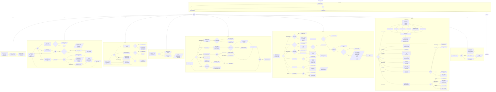

# Admin User Flow

```mermaid
flowchart TD
    Start([Admin Opens Portal]) --> Login

    %% ── AUTH ──────────────────────────────────────────────
    subgraph AUTH["Authentication"]
        Login[Enter Email + Password]
        Login --> AuthCheck{Valid?}
        AuthCheck -- No --> LoginErr[/"Error: Invalid credentials"/]
        LoginErr --> Login
        AuthCheck -- Yes --> Dashboard
    end

    %% ── DASHBOARD HUB ─────────────────────────────────────
    Dashboard([Admin Dashboard])
    Dashboard --> TabSelect{Which tab?}

    TabSelect -- Overview --> OVR
    TabSelect -- Students --> STU
    TabSelect -- Faculty --> FAC
    TabSelect -- Groups --> GRP
    TabSelect -- Panels --> PNL
    TabSelect -- Events --> EVT
    TabSelect -- Exports --> EXP
    TabSelect -- Archive --> ARCH

    %% ── OVERVIEW TAB ──────────────────────────────────────
    subgraph OVR["Overview Tab"]
        Stats[Stats cards:\nTotal Students · Faculty · Groups · Projects\nGroups by status · Unactivated accounts]
        Stats --> GlobalLimits[Set global maxStudents + maxGroups for all faculty\nSave button]
        GlobalLimits --> PerFaculty[Per-faculty override of maxStudents + maxGroups\nSemester-wide totals across all batches]
    end

    %% ── STUDENTS TAB ──────────────────────────────────────
    subgraph STU["Students Tab"]
        StuList[Table with filters:\nBatch · Branch · Group Status · Verification · Participation\nSearch by name or email · Sort by Name / Roll / Batch]

        StuList --> StuAction{Action?}

        %% Edit student
        StuAction -- Edit --> StuEdit[Modal: Name · Email · Roll · Branch · Semester\ntargetBatch for dropper override]
        StuEdit --> StuEditVal{Email and roll unique?}
        StuEditVal -- No --> StuEditErr[/"Error: Email or roll already exists"/]
        StuEditVal -- Yes --> StuSaved[Saved]
        StuSaved --> DropperNote[/"Dropper setup:\nSet targetBatch = batch they are repeating\nStudent now sees that batch directory\nRed Original Batch label shown to faculty"/]

        %% Delete student
        StuAction -- Delete --> StuDelConfirm[Confirmation modal:\nRemoves from any group · Irreversible]
        StuDelConfirm --> StuDel{Confirm?}
        StuDel -- No --> StuList
        StuDel -- Yes --> StuDelCheck{Student is sole member\nof Approved group?}
        StuDelCheck -- Yes --> StuDelWarn[/"Warning: Group will become empty / dissolved"/]
        StuDelWarn --> StuDelDone[User deleted\nCascade: removed from Group.members]
        StuDelCheck -- No --> StuDelDone

        %% Import students
        StuAction -- "Import CSV/XLSX" --> StuUpload[Upload file\nExpected columns: Name · Email · Roll · Branch · Semester]
        StuUpload --> StuPreview[Preview phase]
        StuPreview --> StuRows{Row status?}
        StuRows -- "Green: valid" --> StuGreen[New account OR update to existing]
        StuRows -- "Yellow: name-matched" --> StuYellow[/"Will update existing account\nmatched by name since no email in file"/]
        StuRows -- "Red: invalid" --> StuRed[/"Reason shown:\nMissing required field · Duplicate email in file\nEmail already in DB · Roll already in DB\nNo email + no roll + no name match"/]
        StuGreen --> StuCommit[Commit — only green rows imported\nNew accounts: mustChangePassword + OTP on first login\nUpdated accounts: fields overwritten]
        StuYellow --> StuCommit
        StuCommit --> StuResult[/"Summary: N created · M updated · K failed"/]
        StuResult --> StuList
    end

    %% ── FACULTY TAB ───────────────────────────────────────
    subgraph FAC["Faculty Tab"]
        FacList[Table: Name · Email · Dept · Expertise\nLoad X/Y students X/Y groups · Photo\nSearch + verification filter]

        FacList --> FacAction{Action?}

        %% Create faculty
        FacAction -- "Create Faculty" --> FacCreate[Modal: Name required · Email required · Dept · Expertise]
        FacCreate --> FacCreateVal{Email unique?}
        FacCreateVal -- No --> FacCreateErr[/"Error: Email already exists"/]
        FacCreateVal -- Yes --> FacCreated[Account created\nRole: Faculty · Password: changeme\nmustChangePassword: true · isVerified: true]

        %% Edit faculty
        FacAction -- Edit --> FacEdit[Same fields as student edit + photo upload]
        FacEdit --> FacEditVal{Email unique?}
        FacEditVal -- No --> FacEditErr[/"Error: Email already exists"/]
        FacEditVal -- Yes --> FacSaved[Saved]

        %% Delete faculty
        FacAction -- Delete --> FacDelWarn[/"Warning: Deleting faculty with Approved groups\ndetaches project faculty reference\nReassign groups first"/]
        FacDelWarn --> FacDel{Confirm?}
        FacDel -- No --> FacList
        FacDel -- Yes --> FacDelDone[Faculty deleted\nCascade: removed from Group/Project references]

        %% Capacity config
        FacAction -- "Configure Mentorship Limits" --> FacLimits[Set maxStudents + maxGroups per faculty\nSemester-wide totals across all batches]
        FacLimits --> FacList
    end

    %% ── GROUPS TAB ────────────────────────────────────────
    subgraph GRP["Groups Tab"]
        GrpList[Table: Group # · Batch · Members count · Status\nProject title · Created date\nFilters: Status · Batch · Search]

        GrpList --> GrpAction{Action?}

        GrpAction -- "View Details" --> GrpDetail[Full member list · All projects with statuses\nCreation date]
        GrpAction -- Edit --> GrpEdit[Edit: Group name · targetBatch override · Status]
        GrpEdit --> GrpNote[/"Setting status to Dissolved manually\nmarks group as inactive\nDropper group: set targetBatch to override\naffects panel assignment + capacity lookup"/]
    end

    %% ── PANELS TAB ────────────────────────────────────────
    subgraph PNL["Panels Tab"]
        PnlList[Table: Panel # · Batch · Faculty · Room · Status · Groups count]
        PnlList --> PnlAction{Action?}

        %% Manual create
        PnlAction -- "Create Panel (Manual)" --> PnlManual[Select batch required\nSelect faculty members required\nRoom optional]
        PnlManual --> PnlManualVal{Batch + faculty provided?}
        PnlManualVal -- No --> PnlManualErr[/"Error: Batch and at least one faculty required"/]
        PnlManualVal -- Yes --> PnlCreated[Panel stored\nFaculty notified by email]

        %% Auto create
        PnlAction -- "Auto-Create Panels" --> PnlAutoSelect[Select batch year]
        PnlAutoSelect --> PnlAutoCalc[System calculates:\nApproved groups in batch\nFaculty remaining capacity\nDistributes groups evenly ~3-5 per panel]
        PnlAutoCalc --> PnlAutoCheck{Enough faculty capacity?}
        PnlAutoCheck -- No --> PnlCapWarn[/"Warning: X groups could not be assigned\nIncrease faculty limits or add faculty"/]
        PnlCapWarn --> PnlAutoPreview
        PnlAutoCheck -- "No approved groups" --> PnlNoGroups[/"No approved groups found for this batch"/]
        PnlAutoCheck -- Yes --> PnlAutoPreview[Preview: proposed panel ↔ group assignments]
        PnlAutoPreview --> PnlAutoConfirm{Confirm?}
        PnlAutoConfirm -- No --> PnlList
        PnlAutoConfirm -- Yes --> PnlAutoCreated[Panels created\nAll assigned faculty notified]

        %% Import from Excel
        PnlAction -- "Import from Excel" --> PnlImport[Upload XLSX: Faculty Email · Batch Year · Room]
        PnlImport --> PnlImportPreview{Valid rows?}
        PnlImportPreview -- "Invalid: faculty not found" --> PnlImpErr[/"Row invalid: Faculty email not found in DB"/]
        PnlImportPreview -- "Invalid: no batch year" --> PnlImpErr2[/"Row invalid: Batch year required"/]
        PnlImportPreview -- Valid --> PnlImpCommit[Preview and commit]

        %% Edit / Archive
        PnlAction -- Edit --> PnlEdit[Change faculty · room · batch · archive flag]
        PnlAction -- "Delete/Archive" --> PnlArchive[isArchived = true\nDisappears from active list\nFaculty Panels tab cleared]

        %% Export
        PnlAction -- "Export XLSX" --> PnlExport{Panels exist for batch?}
        PnlExport -- No --> PnlExportEmpty[/"No panels found — nothing downloaded"/]
        PnlExport -- Yes --> PnlExportFile[Panel Summary sheet + individual Panel sheets\nPanel_Distribution_Batch_YYYY.xlsx]
    end

    %% ── EVENTS TAB ────────────────────────────────────────
    subgraph EVT["Events Tab"]
        EvtList[Timeline of events\nGroup Formation · Mid-Term · End-Term\nStatus: Active · Inactive · Ended]
        EvtList --> EvtAction{Action?}

        %% Create GF Event — DESTRUCTIVE
        EvtAction -- "Create Group Formation Event" --> GFGuard{Any Eval event\ncurrently active?}
        GFGuard -- Yes --> GFGuardErr[/"Error: Close the active evaluation event first"/]
        GFGuard -- No --> GFConfig[Set End Date · Extension Date optional\nSelect Participating Batches required\nConfigure rubric Builder or JSON mode]
        GFConfig --> GFPwPrompt[Enter admin password]
        GFPwPrompt --> GFPwCheck{Password correct?}
        GFPwCheck -- No --> GFPwErr[/"Error: Incorrect password — event NOT created"/]
        GFPwCheck -- Yes --> GFDateCheck{End date in future?}
        GFDateCheck -- No --> GFDateErr[/"Error: End date must be in the future"/]
        GFDateCheck -- Yes --> GFBatchCheck{At least 1 batch selected?}
        GFBatchCheck -- No --> GFBatchErr[/"Error: At least one batch must be selected"/]
        GFBatchCheck -- Yes --> GFDestructive[/"DESTRUCTIVE — runs on confirm:\n· All groups → isArchived + Dissolved\n· All projects → isArchived + denormalised snapshot\n· All panels → isArchived\n· Faculty currentStudents/Groups reset to 0\n· Students in matching batches → isParticipating true\n· Email to all participating students"/]
        GFDestructive --> GFCreated[GF Event created and Active]

        %% Create Mid-Term Event
        EvtAction -- "Create Mid-Term Event" --> MidGuard{GF event still active?}
        MidGuard -- Yes --> MidGuardErr[/"Error: Group Formation event is still ongoing"/]
        MidGuard -- No --> MidConfig[Set End Date · Extension optional\nConfigure rubric · Admin password]
        MidConfig --> MidPwCheck{Password correct?}
        MidPwCheck -- No --> MidPwErr[/"Error: Incorrect password"/]
        MidPwCheck -- Yes --> MidCreated[Mid-Term event created\nFaculty Mid-Term tab unlocked]

        %% Create End-Term Event
        EvtAction -- "Create End-Term Event" --> EndGuard{GF event still active?}
        EndGuard -- Yes --> EndGuardErr[/"Error: Group Formation event is still ongoing"/]
        EndGuard -- No --> EndConfig[Same flow as Mid-Term]
        EndConfig --> EndCreated[End-Term event created\nFaculty End-Term tab unlocked\nCan coexist with Mid-Term]

        %% Toggle active/inactive
        EvtAction -- "Toggle Active/Inactive" --> TogglePw[Enter admin password]
        TogglePw --> TogglePwCheck{Correct?}
        TogglePwCheck -- No --> TogglePwErr[/"Error: Incorrect password — toggle NOT applied"/]
        TogglePwCheck -- Yes --> Toggled[isActive flipped\nDeactivated: faculty cannot save evals\nStudents cannot create groups\nReactivation: re-opens window]

        %% Edit event
        EvtAction -- "Edit Event" --> EditEvtPw[Enter admin password]
        EditEvtPw --> EditEvtOk{Correct?}
        EditEvtOk -- No --> EditEvtErr[/"Error: Incorrect password"/]
        EditEvtOk -- Yes --> EditEvt[Change dates · extension · batches · rubric\nDoes NOT re-trigger archival]
        EditEvt --> EditBatchNote[/"Newly added batches: isParticipating set true\nRemoved batches: NOT auto-updated — manual cleanup needed"/]

        %% Delete event
        EvtAction -- "Delete Event" --> DelEvtPw[Enter admin password]
        DelEvtPw --> DelEvtOk{Correct?}
        DelEvtOk -- No --> DelEvtErr[/"Error: Incorrect password"/]
        DelEvtOk -- Yes --> DelEvt[Event removed from DB\nDoes NOT un-archive groups or projects]
    end

    %% ── EXPORTS TAB ───────────────────────────────────────
    subgraph EXP["Exports Tab"]
        ExpSelect{Export type?}

        ExpSelect -- "Student Directory" --> ExpStu[Select batch or All\nStudents_Batch_YYYY.xlsx\n204 returned if no students in batch]

        ExpSelect -- "Faculty Directory" --> ExpFac[Faculty_Directory.xlsx]

        ExpSelect -- "Panel Distribution" --> ExpPnl[Select batch\nPanel Summary + individual Panel sheets\nPanel_Distribution_Batch_YYYY.xlsx\n204 if no panels]

        ExpSelect -- "Evaluations" --> ExpEval[Select batch + type Mid/End/Full\nAll rubric scores per group per student]

        ExpSelect -- "Official IIITNR Format" --> ExpOfficial[Formatted XLSX\nCollege header · Semester · Batch · Academic Year\nPer-panel sheets]

        ExpSelect -- "JSON Snapshot" --> ExpSnap[Full DB export\nStudents · Faculty · Groups · Projects · Panels · Evaluations\nCan be re-imported]

        ExpSelect -- "Complete Database ZIP" --> ExpZip
        subgraph ExpZip["Complete Export (ZIP)"]
            ZipDetect[Detect active batches:\n1 Active GF event participatingBatches\n2 Fallback: student roll number scan\n3 Fallback: current calendar year]
            ZipDetect --> ZipStu[Students per batch XLSX]
            ZipDetect --> ZipFac[Faculty XLSX]
            ZipDetect --> ZipOfficial[Official format per batch]
            ZipDetect --> ZipSnap[JSON snapshot]
            ZipDetect --> ZipPnl[Panel distribution per batch\nFallback: if none found → Panels_All_Batches.xlsx]
            ZipDetect --> ZipEval[Evaluations per batch]
            ZipStu & ZipFac & ZipOfficial & ZipSnap & ZipPnl & ZipEval --> ZipPack[Package into ZIP\nComplete_MINOR_Project_Database_DATE.zip]
            ZipPack --> ZipNote[/"Individual sub-export failures silently skipped\nRest of ZIP still generated\nIf batch detection wrong: sub-exports empty\nWorkaround: download individual exports manually"/]
        end

        %% Imports
        ExpSelect -- "Import: Excel Full" --> ImpExcel[Upload IIITNR official XLSX\nSelect semester\nPreview tab-by-tab]
        ImpExcel --> ImpExcelRows{Row validity?}
        ImpExcelRows -- "Faculty not matched" --> ImpFacErr[/"Faculty Name not found\nCreate faculty account first"/]
        ImpExcelRows -- "Student duplicate" --> ImpStuErr[/"Email exists with different roll"/]
        ImpExcelRows -- "Missing column" --> ImpColErr[/"Required column not found in sheet"/]
        ImpExcelRows -- Valid --> ImpExcelCommit[Commit — students · faculty · groups · projects · panels]

        ExpSelect -- "Import: JSON Snapshot" --> ImpSnap[Upload .json snapshot\nPreview: project count · orphan count · warnings]
        ImpSnap --> ImpSnapRows{Issues?}
        ImpSnapRows -- "Invalid JSON" --> ImpSnapErr[/"Error: Invalid snapshot file"/]
        ImpSnapRows -- "Orphan projects no matching group" --> ImpSnapOrphan[/"Warning: X projects imported as archived orphans\nStudents see them via email match in Archive tab"/]
        ImpSnapRows -- "Duplicate email" --> ImpSnapDup[/"Warning: Email already exists — skipping"/]
        ImpSnapRows -- OK --> ImpSnapCommit[Commit — restores DB state]
    end

    %% ── ARCHIVE TAB ───────────────────────────────────────
    subgraph ARCH["Archive Tab"]
        ArchYear[Select year: All · 2025 · 2024 · ...]
        ArchYear --> ArchSub{Sub-tab?}

        ArchSub -- Projects --> ArchProj[Expandable rows:\nTitle · Mentor · Group · Batch · Members · Eval data\nEdge case: mentor deleted before archival → Mentor: Unknown]
        ArchSub -- Participants --> ArchPart[Name · Email · Roll · Branch · Batch · Groups]
        ArchSub -- Panels --> ArchPanel[Panel compositions + group assignments]

        ArchProj & ArchPart & ArchPanel --> ArchNote[/"Read-only — no editing possible\nCan export to XLSX"/]
    end

    %% ── LOGOUT ────────────────────────────────────────────
    Dashboard --> Logout[Logout]
    Logout --> End([Session ended])
```
