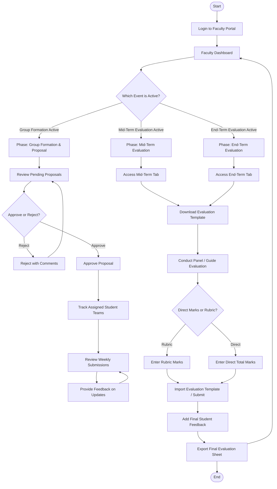

# Faculty User Flow

```mermaid
graph TD
    %% Node Definitions
    Start([Start])
    Login[Login to Faculty Portal]
    Dashboard[Faculty Dashboard]
    
    %% Check Active Events
    CheckEvents{Which Event is Active?}
    
    %% Group Formation & Proposal Phase
    PhaseGF[Phase: Group Formation & Proposal]
    ReviewProposals[Review Pending Proposals]
    ProposalDecision{Approve or Reject?}
    RejectProposal[Reject with Comments]
    ApproveProposal[Approve Proposal]
    
    %% Mentorship & Weekly Tracking
    TrackGroups[Track Assigned Student Teams]
    ReviewUpdates[Review Weekly Submissions]
    ProvideFeedback[Provide Feedback on Updates]
    
    %% Mid-Term Evaluation Phase
    PhaseMid[Phase: Mid-Term Evaluation]
    MidEvalTab[Access Mid-Term Tab]
    
    %% End-Term Evaluation Phase
    PhaseEnd[Phase: End-Term Evaluation]
    EndEvalTab[Access End-Term Tab]
    
    %% Common Evaluation Flow
    DownloadTemplate[Download Evaluation Template]
    ConductEvaluation[Conduct Panel / Guide Evaluation]
    DirectMarksToggle{Direct Marks or Rubric?}
    EnterRubrics[Enter Rubric Marks]
    EnterDirect[Enter Direct Total Marks]
    UploadMarks[Import Evaluation Template / Submit]
    SubmitFinalFeedback[Add Final Student Feedback]
    ExportFinalSheet[Export Final Evaluation Sheet]
    
    End([End])

    %% Flow Connections
    Start --> Login
    Login --> Dashboard
    
    Dashboard --> CheckEvents
    
    %% GF Event Flow
    CheckEvents -- "Group Formation Active" --> PhaseGF
    PhaseGF --> ReviewProposals
    ReviewProposals --> ProposalDecision
    ProposalDecision -- Reject --> RejectProposal
    RejectProposal --> ReviewProposals
    ProposalDecision -- Approve --> ApproveProposal
    ApproveProposal --> TrackGroups
    
    %% Always available for approved groups
    TrackGroups --> ReviewUpdates
    ReviewUpdates --> ProvideFeedback
    ProvideFeedback --> ReviewUpdates
    
    %% Mid-Term Event Flow
    CheckEvents -- "Mid-Term Evaluation Active" --> PhaseMid
    PhaseMid --> MidEvalTab
    MidEvalTab --> DownloadTemplate
    
    %% End-Term Event Flow
    CheckEvents -- "End-Term Evaluation Active" --> PhaseEnd
    PhaseEnd --> EndEvalTab
    EndEvalTab --> DownloadTemplate
    
    %% Evaluation Logic
    DownloadTemplate --> ConductEvaluation
    ConductEvaluation --> DirectMarksToggle
    DirectMarksToggle -- Rubric --> EnterRubrics
    DirectMarksToggle -- Direct --> EnterDirect
    EnterRubrics --> UploadMarks
    EnterDirect --> UploadMarks
    UploadMarks --> SubmitFinalFeedback
    SubmitFinalFeedback --> ExportFinalSheet
    
    ExportFinalSheet --> Dashboard
    ExportFinalSheet --> End
```
