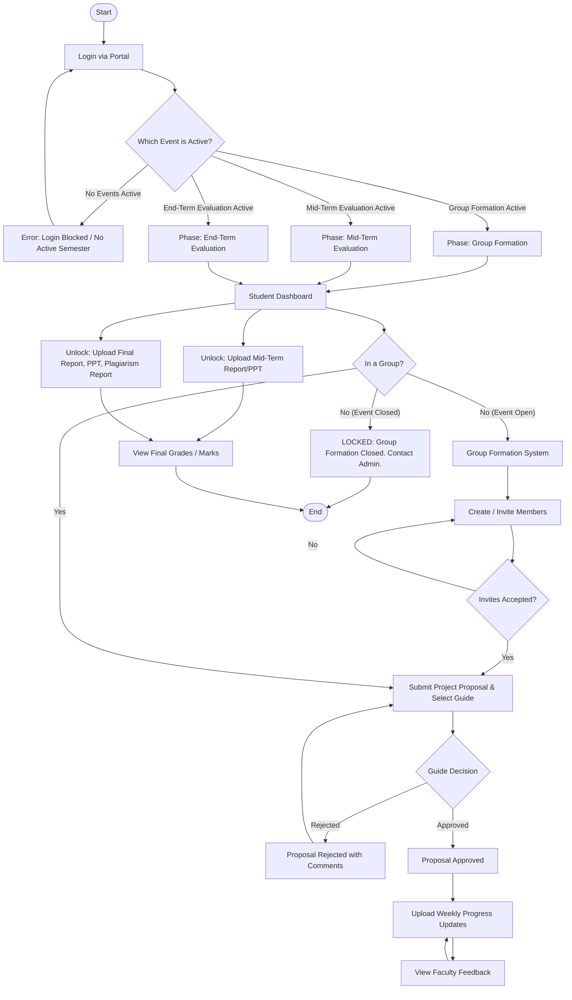

# Student User Flow

```mermaid
graph TD
    %% Node Definitions
    Start([Start])
    Login[Login via Portal]
    
    CheckActiveEvent{Which Event is Active?}
    LoginError[Error: Login Blocked / No Active Semester]
    
    Dashboard[Student Dashboard]
    
    %% GF & Proposal Phase
    PhaseGF[Phase: Group Formation]
    CheckGroup{In a Group?}
    NoGroupLock[LOCKED: Group Formation Closed. Contact Admin.]
    GroupFormation[Group Formation System]
    CreateGroup[Create / Invite Members]
    WaitInvites{Invites Accepted?}
    ProjectProposal[Submit Project Proposal & Select Guide]
    WaitApproval{Guide Decision}
    ProposalRejected[Proposal Rejected with Comments]
    ProposalApproved[Proposal Approved]
    
    %% Mid-Term Phase
    PhaseMid[Phase: Mid-Term Evaluation]
    UploadMidTerm[Unlock: Upload Mid-Term Report/PPT]
    
    %% End-Term Phase
    PhaseEnd[Phase: End-Term Evaluation]
    UploadEndTerm[Unlock: Upload Final Report, PPT, Plagiarism Report]
    
    %% Common Tasks
    UploadUpdates[Upload Weekly Progress Updates]
    ViewFeedback[View Faculty Feedback]
    ViewGrades[View Final Grades / Marks]
    
    End([End])

    %% Flow Connections
    Start --> Login
    Login --> CheckActiveEvent
    
    CheckActiveEvent -- "No Events Active" --> LoginError
    LoginError --> Login
    
    CheckActiveEvent -- "Group Formation Active" --> PhaseGF
    PhaseGF --> Dashboard
    Dashboard --> CheckGroup
    
    CheckGroup -- "No (Event Closed)" --> NoGroupLock
    NoGroupLock --> End
    
    CheckGroup -- "No (Event Open)" --> GroupFormation
    GroupFormation --> CreateGroup
    CreateGroup --> WaitInvites
    WaitInvites -- No --> CreateGroup
    WaitInvites -- Yes --> ProjectProposal
    
    CheckGroup -- "Yes" --> ProjectProposal
    ProjectProposal --> WaitApproval
    WaitApproval -- Rejected --> ProposalRejected
    ProposalRejected --> ProjectProposal
    WaitApproval -- Approved --> ProposalApproved
    
    ProposalApproved --> UploadUpdates
    UploadUpdates --> ViewFeedback
    ViewFeedback --> UploadUpdates
    
    CheckActiveEvent -- "Mid-Term Evaluation Active" --> PhaseMid
    PhaseMid --> Dashboard
    Dashboard --> UploadMidTerm
    UploadMidTerm --> ViewGrades
    
    CheckActiveEvent -- "End-Term Evaluation Active" --> PhaseEnd
    PhaseEnd --> Dashboard
    Dashboard --> UploadEndTerm
    UploadEndTerm --> ViewGrades
    
    ViewGrades --> End
```
